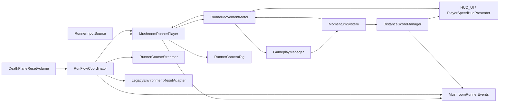
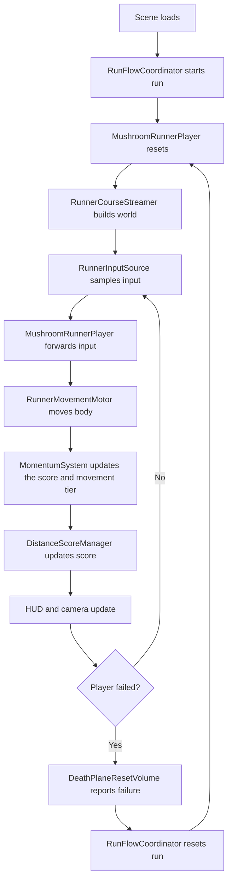

# MushroomRunner Overview

Use [MushroomRunner-System-Wiring.md](/d:/Work/FunGuy/Docs/MushroomRunner-System-Wiring.md) when you need the exact scene references and serialized wiring.

Use this document first when you want the fast mental model: who owns what, what talks to what, and how a run moves from input to score to reset.

## 30-Second Mental Model

- `MushroomRunnerPlayer` is the gameplay brain on the player.
- `RunnerMovementMotor` is the body that actually moves.
- `RunnerCameraRig` follows the player's `CameraFollowTarget` child, not the root transform.
- `MomentumSystem` selects score and movement tiers; `DistanceScoreManager` awards distance points.
- `RunFlowCoordinator` owns run start, run reset, and failure recovery.

The scene that wires this all together is [MushroomRunnerGameplay.unity](/d:/Work/FunGuy/Assets/_Game/Funguy.MushroomRunner/Scenes/MushroomRunnerGameplay.unity), and the player root is [MushroomRunnerPlayer.prefab](/d:/Work/FunGuy/Assets/_Game/Funguy.MushroomRunner/Prefabs/MushroomRunnerPlayer.prefab).

## Component Map

If Mermaid does not render, read it like this:

- input feeds the player
- the player commands the motor
- the motor reports movement results to the player; GameplayManager feeds forward speed to the momentum system
- multiplier feeds score
- run flow resets player, world, and legacy environment
- HUD reads score and motor state
- camera follows the player's follow target

## Runtime Story

If Mermaid does not render, the loop is:

1. The run coordinator starts the run.
2. The player resets to a clean state.
3. The course streamer rebuilds the route.
4. Input is sampled each frame.
5. The player passes input into the motor.
6. The motor moves and bounces.
7. Multiplier and score update from movement.
8. HUD and camera reflect the latest state.
9. Death detection reports failure and the coordinator resets the run.

## Player

### What it owns

- player state
- dash lifecycle
- current input frame
- reset entry point for the player body

### Scripts/components

- [MushroomRunnerPlayer.cs](/d:/Work/FunGuy/Assets/_Game/Funguy.MushroomRunner/Player/MushroomRunnerPlayer.cs)
- [RunnerMovementMotor.cs](/d:/Work/FunGuy/Assets/_Game/Funguy.MushroomRunner/Movement/RunnerMovementMotor.cs)
- `Rigidbody`
- `SphereCollider`
- `CameraFollowTarget`

### Talks to

- `RunnerInputSource`
- `RunFlowCoordinator`
- `DistanceScoreManager`
- `RunnerCameraRig`
- `MushroomRunnerEvents`

### Where it is wired

- player root is [MushroomRunnerPlayer.prefab](/d:/Work/FunGuy/Assets/_Game/Funguy.MushroomRunner/Prefabs/MushroomRunnerPlayer.prefab)
- scene instance is in [MushroomRunnerGameplay.unity](/d:/Work/FunGuy/Assets/_Game/Funguy.MushroomRunner/Scenes/MushroomRunnerGameplay.unity)

### When it runs

- `Awake()` pushes the tuning profile into the motor and wires dash resources
- `OnEnable()` subscribes to motor events
- `Update()` reads input and commands the motor
- `ResetRun(...)` restores the player after start or death

The key mental model is: `MushroomRunnerPlayer` decides what the player is trying to do, while `RunnerMovementMotor` decides how the body actually moves.

## Camera

### What it owns

- follow behavior
- framing offset
- FOV response from movement speed

### Scripts/components

- [RunnerCameraRig.cs](/d:/Work/FunGuy/Assets/_Game/Funguy.MushroomRunner/Core/RunnerCameraRig.cs)
- player child `CameraFollowTarget`

### Talks to

- player `CameraFollowTarget`
- player `Rigidbody` or resolved velocity source

### Where it is wired

- camera script lives on `Main Camera` in [MushroomRunnerGameplay.unity](/d:/Work/FunGuy/Assets/_Game/Funguy.MushroomRunner/Scenes/MushroomRunnerGameplay.unity)
- its `target` is assigned to the player child's `CameraFollowTarget`

### When it runs

- `LateUpdate()` follows the target after movement is applied

The important idea is that the camera follows a dedicated composition target, so camera framing stays decoupled from the player's physics pivot.

## Score And Movement Tiers

`MomentumSystem` owns the four tiers: Low (x1), Medium (x2), High (x3), and Maximum (x4). Forward speed and landing quality update momentum using the existing thresholds and rewards.

`DistanceScoreManager` awards forward distance points using the current tier's scoring multiplier. `HUD_UI` receives score and multiplier updates through `GameplayEvents`.

`GameplayManager` binds the movement motor to the score manager's momentum source. Each `MovementTuningProfile` exposes **Max Speed x1**, **x2**, **x3**, and **x4**, in world units per second. These are independent soft horizontal limits; they do not multiply velocity. All four values initially preserve each profile's previous maximum.

`RunnerMovementMotor.CurrentMaxSpeed` resolves the active profile and tier. Tier decreases use overspeed drag, while tier increases allow further acceleration without injecting velocity. Steering cannot target more than the tier maximum; bounce speed retention uses the same limit. Vertical bounce and dash velocity are unaffected.

`GameplayManager.SetActiveTuningProfile(...)` applies the profile through the player before notifying the HUD. Profile assets are never modified by runtime tier changes. Without a momentum source the motor uses x1. Re-enabling synchronizes the current tier and restores event subscriptions.

`BounceReachRequest.MaximumSpeed` carries the resolved limit into course reach prediction. Standalone requests default to the profile's x1 speed.

## World

### What it owns

- start route creation
- forward course generation
- cleanup of old generated content

### Scripts/components

- [RunnerCourseStreamer.cs](/d:/Work/FunGuy/Assets/_Game/Funguy.MushroomRunner/World/RunnerCourseStreamer.cs)
- `BounceAreaGenerationProfile`
- `BounceSpawnDefinition`

### Talks to

- player transform
- `DistanceScoreManager`
- `RunFlowCoordinator`

### Where it is wired

- `RunnerCourseStreamer` lives in `_Systems` in [MushroomRunnerGameplay.unity](/d:/Work/FunGuy/Assets/_Game/Funguy.MushroomRunner/Scenes/MushroomRunnerGameplay.unity)
- generated mushrooms go under `GeneratedMushrooms`
- generated environment goes under `GeneratedEnvironment`

### When it runs

- `BuildInitialWorld()` runs at start and reset
- `Update()` keeps spawning ahead and recycling behind the player

The world system does not own run state. It responds to run flow and rebuilds the track around the current player run.

## Reset And Failure

### What it owns

- initial run start
- reset ordering
- spawn pose selection
- failure detection
- legacy environment reset bridge

### Scripts/components

- [RunFlowCoordinator.cs](/d:/Work/FunGuy/Assets/_Game/Funguy.MushroomRunner/Core/RunFlowCoordinator.cs)
- [DeathPlaneResetVolume.cs](/d:/Work/FunGuy/Assets/_Game/Funguy.MushroomRunner/World/DeathPlaneResetVolume.cs)
- [LegacyEnvironmentResetAdapter.cs](/d:/Work/FunGuy/Assets/_Game/Funguy.MushroomRunner/World/LegacyEnvironmentResetAdapter.cs)

### Talks to

- `MushroomRunnerPlayer`
- `RunnerCourseStreamer`
- `MushroomRunnerEvents`
- legacy `BlockSpawner` systems

### Where it is wired

- `RunFlowCoordinator` lives in `_Systems`
- `DeathPlaneResetVolume` lives in `_Runtime`
- `LegacyEnvironmentResetAdapter` lives in `_Systems`

### When it runs

- `RunFlowCoordinator.Start()` kicks off the first run
- `ReportFailure(...)` handles death and triggers reset
- `DeathPlaneResetVolume` watches for trigger hits and low-height failure

The reset order is always:

1. reset the player
2. rebuild the course
3. reset legacy environment
4. raise the run lifecycle event

## HUD

### What it owns

- score text
- status text
- speed meter presentation

### Scripts/components

- [HUD_UI.cs](/d:/Work/FunGuy/Assets/_Game/Scripts/UI/HUD_UI.cs)
- [PlayerSpeedHudPresenter.cs](/d:/Work/FunGuy/Assets/_Game/Funguy.MushroomRunner/Core/PlayerSpeedHudPresenter.cs)

### Talks to

- `DistanceScoreManager`
- `RunnerMovementMotor`

### Where it is wired

- `HUD_UI` binds the current score, multiplier, momentum bars, and dash indicators
- `PlayerSpeedHudPresenter` lives on `SpeedMeter`
- both are authored in the HUD hierarchy inside [MushroomRunnerGameplay.unity](/d:/Work/FunGuy/Assets/_Game/Funguy.MushroomRunner/Scenes/MushroomRunnerGameplay.unity)

### When it runs

- `HUD_UI` updates through `GameplayEvents.OnScoreChanged` and `OnMultiplierChanged`
- `PlayerSpeedHudPresenter.Update()` refreshes from motor speed

The HUD is intentionally presentation-only. It does not own gameplay state.

## Legacy Boundary

### What it owns

- nothing inside the MushroomRunner loop

### Scripts/components

- [GameManager.cs](/d:/Work/FunGuy/Assets/_Game/Scripts/Gameplay/GameManager.cs)
- older spawner and bouncer systems (the runner does use `GameplayManager` and `DistanceScoreManager` from this directory)

### Talks to

- older `MushroomSpawner_XAxis` and `CreatureBouncer_XAxis` flows

### Where it is wired

- outside the `Funguy.MushroomRunner` module

### When it runs

- only in the older gameplay path, not in MushroomRunner

If you are debugging the current runner, start inside [Assets/_Game/Funguy.MushroomRunner](/d:/Work/FunGuy/Assets/_Game/Funguy.MushroomRunner). Do not start from `GameManager`.

## Where To Edit What

- Change player rules, state, dash logic, or reset behavior in [MushroomRunnerPlayer.cs](/d:/Work/FunGuy/Assets/_Game/Funguy.MushroomRunner/Player/MushroomRunnerPlayer.cs).
- Change actual movement feel, gravity, bounce, or dash force in [RunnerMovementMotor.cs](/d:/Work/FunGuy/Assets/_Game/Funguy.MushroomRunner/Movement/RunnerMovementMotor.cs).
- Change camera framing or FOV response in [RunnerCameraRig.cs](/d:/Work/FunGuy/Assets/_Game/Funguy.MushroomRunner/Core/RunnerCameraRig.cs).
- Change distance score math in [DistanceScoreManager.cs](/d:/Work/FunGuy/Assets/_Game/Scripts/Gameplay/DistanceScoreManager.cs).
- Change route generation in [RunnerCourseStreamer.cs](/d:/Work/FunGuy/Assets/_Game/Funguy.MushroomRunner/World/RunnerCourseStreamer.cs).
- Change reset and failure flow in [RunFlowCoordinator.cs](/d:/Work/FunGuy/Assets/_Game/Funguy.MushroomRunner/Core/RunFlowCoordinator.cs) and [DeathPlaneResetVolume.cs](/d:/Work/FunGuy/Assets/_Game/Funguy.MushroomRunner/World/DeathPlaneResetVolume.cs).
- Change the exact serialized wiring reference in [MushroomRunner-System-Wiring.md](/d:/Work/FunGuy/Docs/MushroomRunner-System-Wiring.md).

Tier thresholds and landing rewards are configured on `MomentumSystem`. Per-tier maximum movement speeds are configured on `MovementTuningProfile`.
