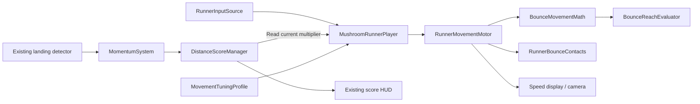

# Mushroom Runner overview

The player owns movement tuning, the motor owns physics, and the existing momentum and distance systems own scoring.

## Speed gears

BalancedMomentum uses x1 → 15, x2 → 25, x3 → 40, and x4 → 60 world units/second. The list is expandable. Fractional multipliers use the completed integer gear; values above the list use its last speed. Missing scoring uses x1. Empty lists use 15/25/40/60.

A gear changes horizontal speed capacity. Bounces and steering build speed, and the existing proportional overspeed slowdown gently sheds excess speed. Vertical launch velocity is unaffected. Temporary bounce overspeed remains possible. A downshift also lowers the retained bounce-speed floor so a later upshift cannot restore the old speed for free.

Steering has its own directional speed limit. BalancedMomentum keeps this at 15: a bounce can carry the player faster than steering alone can accelerate along the requested direction. This preserves the current air-control model.

## Designer tuning

Select BalancedMomentum and use Speed Gears, Steering, Bounce, and Air Jump for ordinary tuning. Advanced contains turn braking, steering speed limit, drag, gravity and bounce flight shaping, temporary control windows, and contact forgiveness. Launch speeds are in world units/second, acceleration is in world units/second squared, and timing is in seconds.

The former acceleration and strength fields are combined as `airAcceleration = moveAcceleration * airControlStrength`. Independent turn braking preserves the old `airBrakeAcceleration + moveAcceleration` calculation. BalancedMomentum starts at 28.5 air acceleration, 43 turn braking, and 24 braking. Its previous soft cap was 48; the new gear table is an intentional balance change.

Other existing presets retain their former maximum as a single gear. Asset GUIDs, mushroom bounce profiles, camera settings, and the new scoring rules remain intact.

## Validation

Run **Tools → Mushroom Runner → Validate Movement and Gears** in Unity. The checks compare the movement formulas against recorded traces from the original code at a 48 ceiling, exercise gear transitions and motor state, and inspect both runner scenes. The baseline includes steering, diagonal turns, reversal, braking, coasting, and normal/boost/slow launch arcs at several speeds.

These deterministic checks do not replace a keyboard/touch playtest. Compare bounce rhythm, steering recovery, air jumps, and landings at 40/60 before accepting the final balance. Reach evaluation remains an approximation; it does not predict future multiplier changes or fully reproduce the motor's retained-speed floor.

See [System wiring](MushroomRunner-System-Wiring.md) for references and lifecycle details.
